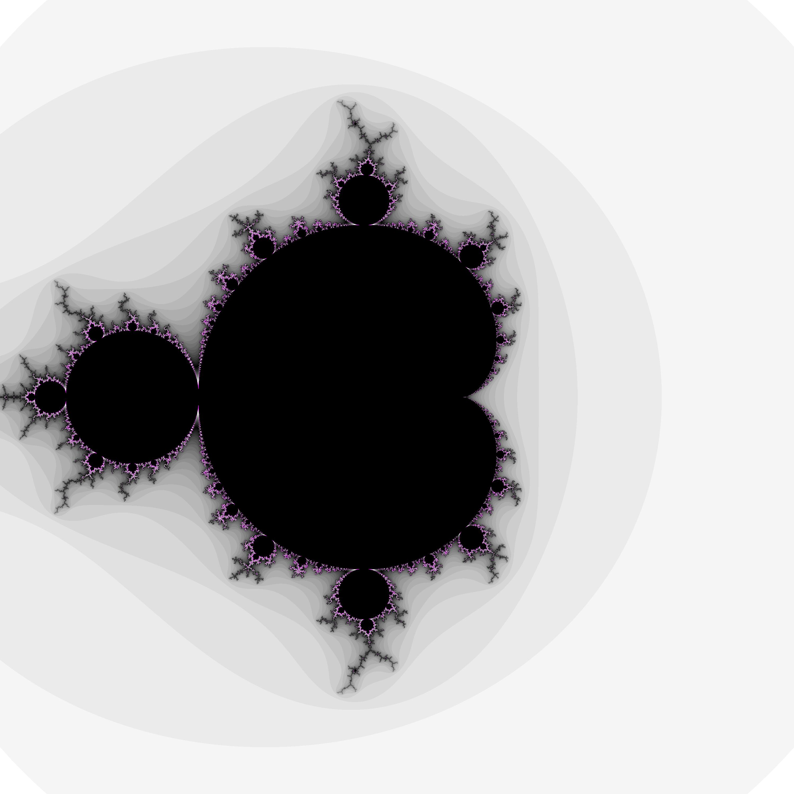

# mandelbrot-cli

### Overview

The Mandelbrot set $\mathbb {M}$ is a set of complex numbers $c$ for which the sequence $(z_{c,n})$ with $z_{c,n+1}=z_{c,n}^2+c$ does not diverge to infinity when iterated from $z_{c,0}=0$. If you represent each $c$ of this set in the complex number plane and assign a color value to each depending on whether and after how many iterations it becomes clear that the sequence $z_{c,n}$ diverges towards infinity, a picture emerges. This application creates such an image based on configurations written in a file. 

### What is $n_{max}$ and how is $\mathbb {M}$ calculated?

To a certain extent, the number $n_{max} \in \mathbb {N}$ determines the accuracy of the calculation. 

Let $c \in \mathbb {C}$. To find out whether $c \in \mathbb {M}$, it must be checked whether the sequence $\(z_{c,n}\)$ remains bounded. To do so, this application tries to calculate the sequence starting from $z_{c,0}=0$ up to $z_{c,n_{max}}$. If during this calculation there where any $n < n_{max}$ so that $|z_{c,n}| > 2$, this algorithm will terminate prematurely. Because in that case it is proven that $\(z_{c,n}\)$ will definitely diverge to infinity (for proof, see [explanation of Mike Hurley](http://mrob.com/pub/muency/escaperadius.html)). On the other hand if this calculation reaches $z_{c,n_{max}}$, meaning $|z_{c,n}| \leq 2$ for all $n < n_{max}$, this application will assume that $c \in \mathbb {M}$. However, this assumption is by no means exact, especially in the marginal areas of the Mandelbrot set. Because there are always some $c \notin \mathbb {M}$ for which $|z_{c,n}|$ will not be greater than 2 until $z_{c,k}$ ($k > n_{max}$) has been calculated. Thus, as $n_{max}$ is increased, more and more numbers which were previously erroneously assumed to be in the set are discarded. 

### How is the image colored?

Let $c \in {C}$. To visualize $\mathbb {M}$ as a mathematical set, only two colors are needed: one for $c \in \mathbb {M}$ and one for $c \notin \mathbb {M}$. But a two-tone image is boring. Therefore in this application one can specify one color for all $c$ for which $c \in \mathbb {M}$ is assumed and up to five colors that form a color gradient for $c \notin \mathbb {M}$. 

Let $c \notin \mathbb {M}$ and let $z_{c,k} > 2$ with $k \in \mathbb {N}$ be the first element in the sequence which absolute value is greater than 2. Then, according to the algorithm described above, $z_{c,k}$ is the last number that got calculated while iterating $\(z_{c,n}\)$ from $z=0$. Depending on where $k$ is between $0$ and $n_{max}$, a color is picked from the gradient. As a result, the degree of divergence of $\(z_{c,n}\)$ the can be seen in the image. 

### How to use this application

This is an application to run on the command line. 

You can get a picture of the Mandelbrot set by executing this application with following arguments: 

```bash
[OPTIONS] <configuration path> <picture width> <picture height> <output path>
```

The application reads the yaml data that is written to the specified configuration file and creates an image based on this data. The dimensions of the image must be specified in the command itself. If the aspect ratio of the complex number plane view port does not match the ratio specified in the command, a background pattern is created. This image is saved at the specified output path. There are also optional arguments that can be added before specifying the configuration path: 

`-v` 	prints detailed information about the calculation (verbose)
`-o` 	opens the image after the calculation is completed

These arguments can also be combined. For example: `-vo` or `-ov`. 

### Example interaction

A correct command might look like this:

```bash
java -jar mandelbrot-cmd.jar -vo ./config.yaml 3000 3000 ./aNicePicture.png 
```

The configuration file must be of type yaml and be structured as follows: 

```yaml
# Area of the complex plane given by two numbers 'min' (lower left corner) and 'max' (upper right corner)
minRe: -1.5
minIm: -1.5
maxRe: 1.5
maxIm: 1.5
# Maximum amount of iterations (iteration depth)
nMax: 10000
# Color (hexadecimal representation) for points inside of the mandelbrot set
innerColor: 0x000000
# Color gradient (hexadecimal representation) for points outside of the mandelbrot set
# > First color for n_max-1 iterations reached
# > Last color for 0 iterations reached
# At least one color must be specified
colorGradient: [0xFFFFFF, 0x0048ff, 0xffff00]
```

